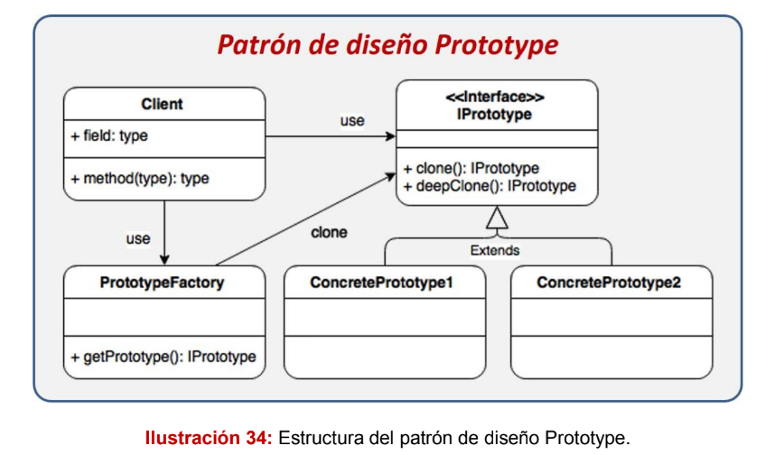
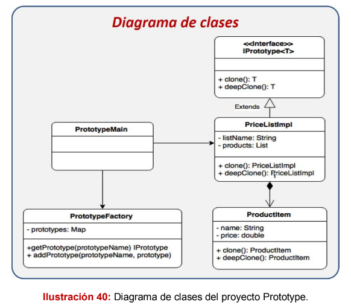

# Patrón Prototype

El patrón Prototype basa su funcionalidad en la clonación de objetos, estos
nuevos objetos son creados mediante un pool de prototipos elaborados
previamente y almacenados. Este patrón es especialmente útil cuando
necesitamos crear objetos basados en otros ya existentes o cuando se necesita
la creación de estructuras de objetos muy grandes, este patrón nos ayuda también
a ocultar la estrategia utilizada para clonar un objeto.

Nos permite copiar objetos existentes sin que el código dependa de sus clases.

El patrón declara una interfaz común para todos los objetos que soportan la clonación. Esta interfaz nos permite clonar un objeto sin acoplar el código a la clase de ese objeto. Normalmente, dicha interfaz contiene un único método clonar.

La implementación del método clonar es muy parecida en todas las clases. El método crea un objeto a partir de la clase actual y lleva todos los valores de campo del viejo objeto, al nuevo. 

## Cuándo utilizarlo:
- Cuando se necesitan crear nuevos objetos basados en objetos
existentes.
- Cuando la creación directa de un objeto por medio del operador new
puede ser perjudicial.
- Cuando se tiene gran cantidad de objetos con atributos repetidos,
siempre es mucho más rápido clonar que crear nuevos objetos y setear
cada valor.

La estructura del patrón se basa.
- Interface, en el caso de Java se debe extender de la clase Cloneable para utilizar las funciones predeterminadas(IProperty).
- Crear clase Factory para creación y guardar colección de los prototipos(PrototypeFactory).
- ProductItem, es el item que va a contener la colección.
- Implementación de la lista de objetos, para clonar.

